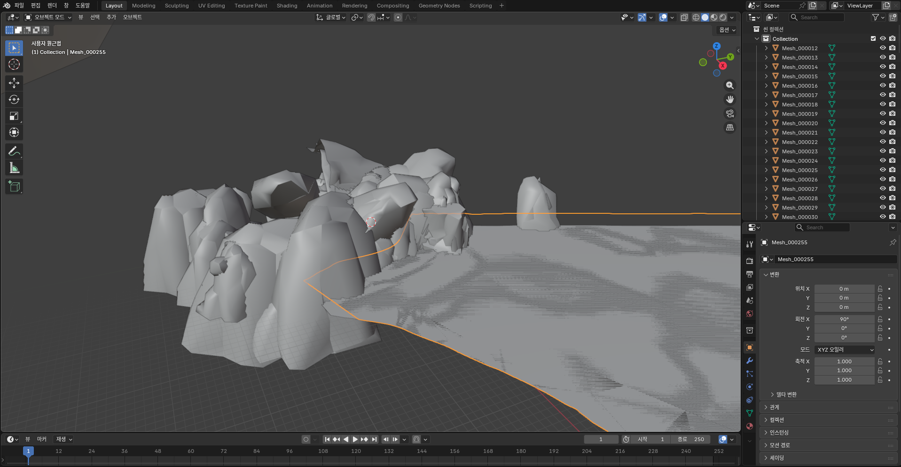
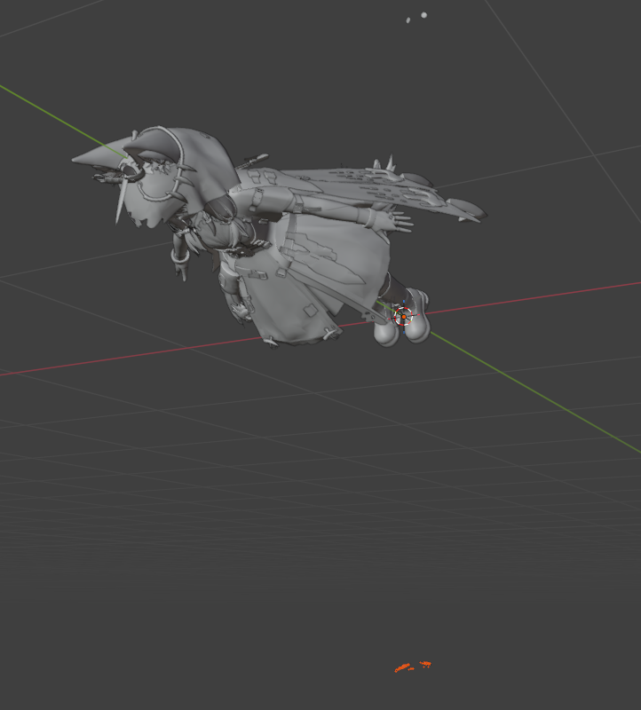
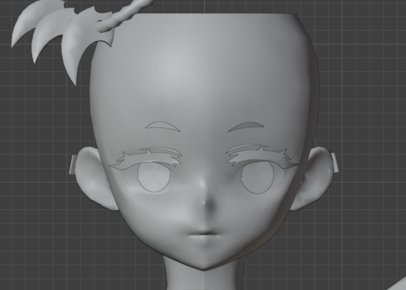
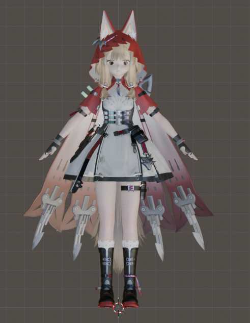

<h1 align="center">EFMI Tools 임시 보조 툴</h1>

## 공지사항

- 현재, **EFMI Tools**의 블렌더 작동오류로 인해 최소 기능을 구현함 앞으로 EFMI Tools의 업데이트 현황에 따라 추가 업데이트 예정

## 특징

- **프레임 덤프 데이터 추출** —엔드필드 프레임 덤프에서 객체를 완전 자동으로 추출합니다.
- **추출된 객체 가져오기** —추출된 객체를 편집 가능한 메시로 저장한다.

## 알려진 문제점(중요!!!!!!)

- 케릭터 mesh 추출을 위해 모든 mesh가 같이 추출됨 -> **필요 객체 선별 필요**
- 케릭터의 특정 mesh의 위치값을 **편집 프로그램으로 수정 필요(ex: 블렌더)**

## 계획된 기능
- **자동 케릭터 추출** —각 캐릭터의 사용되는 해시값을 저장해 놓고 캐릭터만 분리 가능하게 한다.

### 요구사항
- Python 3.x
- PIL/Pillow

## 설치
1. 파일 압축 해제
2. python mesh_extractor_gui.py 또는 MeshExtractor.exe를 더블클릭

## 사용 방법

### 1. 입력/출력 폴더 설정

1. **입력 폴더**: 메쉬 데이터가 있는 FrameAnalysis 폴더 선택
2. **출력 폴더**: 추출된 OBJ 파일을 저장할 위치 (기본값: `./Extracted_Meshes`)

### 2. 옵션 설정

#### 좌표계 선택

| 옵션 | 설명 |
|------|------|
| **Reference** (Z-up, chen.obj 기준) | 기본값, Z축이 위를 향함 |
| **Blender** (Y-up) | 블렌더 호환용, Y축이 위를 향함 |
| **Original** (DirectX 원본) | 변환 없음, 원본 데이터 유지 |

#### 내보내기 옵션(선택사항)

- ✅ **개별 OBJ 파일 내보내기**: 각 메쉬를 별도 파일로 저장
- ✅ **결합된 OBJ 파일 내보내기**: 모든 메쉬를 `combined_mesh.obj` 하나로 통합

### 3. 메쉬 목록 불러오기

1. **"메쉬 목록 불러오기"** 버튼 클릭
2. 사용 가능한 메쉬들이 트리뷰에 표시됩니다
3. 표시 정보:
   - **ID**: 메쉬 식별자
   - **버텍스**: 정점 개수
   - **삼각형**: 면 개수
   - **VS 해시**: 버텍스 셰이더 해시
   - **VB0 Parent**: VB0 부모 해시

### 4. 중복 메쉬 제거 (선택사항)

1. **"중복 제거"** 버튼 클릭
2. 자동으로 중복 메쉬를 감지하여 제거
3. 결과 확인:
   - 제거 전/후 메쉬 개수
   - 제거된 메쉬 ID 목록

### 5. 추출 시작

1. **"추출 시작"** 버튼 클릭
2. 로그 창에서 진행 상황 확인
3. 추출 완료 후 자동으로 후처리 출력 폴더에 저장

### 6. mesh 편집
1. 필요 없는 mesh 삭제

2. 특정 mesh 올바른 위치로 이동

로시의 경우 **calldaw 13과 14** 눈과 눈섭 부분의 mesh 분할과 이동이 필요하다. 

3. FrameAnalysis-deduped속에 위치한 texture 파일을 각 부위에 적용
